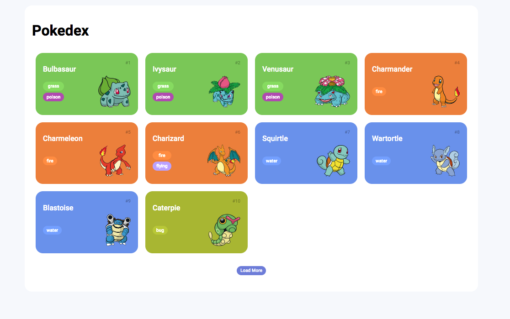

# Pokedex1
<h1 align="center"> Player Music </h1>

Programa exclusivo e gratuito, promovido pela DIO para ensino de tecnologias WEB.  
<a href="https://www.dio.me/">Estude esse projeto em formato de vídeo clicando aqui.</a>

  <a href="#-tecnologias">Tecnologias</a>&nbsp;&nbsp;&nbsp;|&nbsp;&nbsp;&nbsp;
  <a href="#-projeto">Projeto</a>&nbsp;&nbsp;&nbsp;|&nbsp;&nbsp;&nbsp;
  <a href="#-layout">Layout</a>&nbsp;&nbsp;&nbsp;|&nbsp;&nbsp;&nbsp;
  <a href="#memo-licença">Licença</a>

 

  

## 🚀 Tecnologias

Esse projeto foi desenvolvido com as seguintes tecnologias:

- HTML, CSS e Javascript

## 💻 Projeto

O projeto e uma pokedex, um convite em forma de desafio para você apostar na sua evolução em programação. 

- [Acesse o projeto finalizado, online](https://github.com/matheussouza-ap/Pokedex1)

- [Assista a aula](https://www.dio.me/)

## 🔖 Layout

Você pode visualizar o layout do projeto através [DESSE LINK](https://github.com/matheussouza-ap/Pokedex1).

---

Feito com ♥ by Matheus :wave: [Linkedin!](https://www.linkedin.com/in/matheus-a-souza-329688199/)# Pokedex1
# Pokedex1
